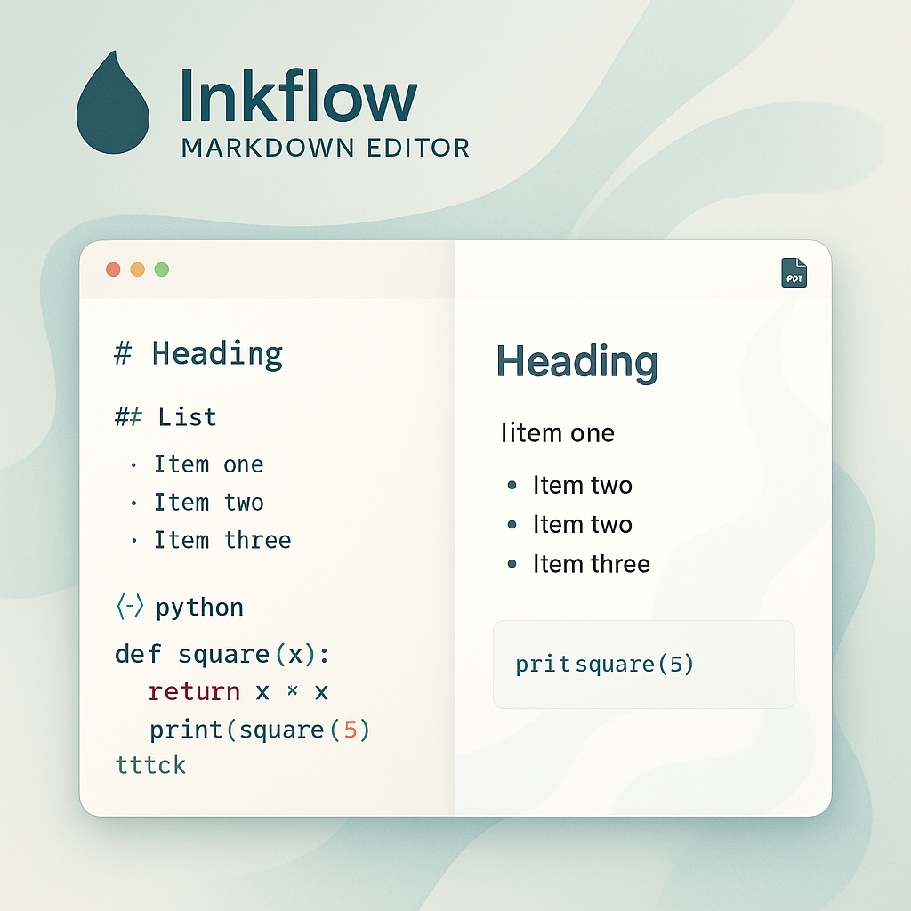

# 雅辑Markdown (Inkflow Markdown Editor)

雅辑Markdown 是一款采用优雅清新美学设计的 Markdown 编辑器，注重美学与功能的完美平衡。它支持实时预览 Markdown 文本，并能通过浏览器的打印功能将内容导出为高质量的 PDF 文档。



## ✨ 功能特性

*   **实时预览**: 在您输入 Markdown 文本时，即时在右侧面板看到渲染后的效果。
*   **优雅清新设计**: 采用 Tailwind CSS精心定制样式，提供舒适、沉浸式的阅读和编辑体验。
*   **PDF 导出**: 利用浏览器的原生打印功能导出为 PDF，确保导出内容与预览高度一致。
*   **自定义 PDF 标题**: 用户可以在导出 PDF 前自定义文件的标题。
*   **响应式设计**: 界面适应不同屏幕尺寸。
*   **纯客户端运行**: (构建后) 所有核心操作均在浏览器端完成。

## 🛠️ 技术栈

*   **前端框架**: React (v19) with TypeScript (JSX)
*   **UI 样式**: Tailwind CSS (通过 CDN 加载，并在 `<style type="text/tailwindcss">` 中进行JIT处理或自定义)
*   **Markdown 解析**: `marked.js` (通过 CDN 加载)
*   **PDF 导出**: 浏览器原生 `window.print()` 功能
*   **模块系统**: ES Modules (ESM), 开发时由 Node.js 开发服务器处理
*   **包管理**: npm (或 yarn/pnpm)

## 🚀 如何运行 (本地开发)

要成功在本地运行此项目进行开发，您需要 Node.js 和 npm (或兼容的包管理器) 环境。

1.  **环境准备**:
    *   安装 [Node.js](https://nodejs.org/) (推荐最新 LTS 版本)，npm 会随 Node.js 一起安装。
    *   一个现代的 Web 浏览器（如 Chrome, Firefox, Edge, Safari）。

2.  **获取代码**:
    *   通过 Git 克隆仓库：
        ```bash
        git clone git@github.com:imbyron/Inkflow-Markdown-Editor.git
        cd Inkflow-Markdown-Editor
        ```
    *   或者，如果您已拥有包含所有项目文件的文件夹，请在该文件夹的根目录下打开您的终端。**确保该文件夹中包含一个 `package.json` 文件，其中定义了项目的依赖和脚本。**

3.  **安装依赖**:
    *   在项目的根目录下 (包含 `package.json` 文件的目录)，运行以下命令来安装项目所需的依赖项。这些依赖项应在 `package.json` 文件中定义，例如 React、ReactDOM 以及开发服务器相关的包 (如 Vite, Parcel, 或 Create React App 的脚本依赖)。
        ```bash
        npm install
        ```
        *(如果您使用 yarn 或 pnpm, 请使用相应的命令如 `yarn install` 或 `pnpm install`)*

4.  **启动开发服务器**:
    *   安装完依赖后，运行以下命令来启动本地开发服务器：
        ```bash
        npm run dev
        ```
        *(这个命令通常在项目的 `package.json` 文件的 `scripts` 部分定义。它会启动一个开发服务器，如 Vite, Parcel, 或 `react-scripts start`，该工具会自动处理 TypeScript/JSX 编译、模块热替换 (HMR) 等功能，并提供一个本地访问地址。)*
    *   开发服务器启动后，通常会在终端输出一个本地访问地址，例如 `http://localhost:5173` (Vite 默认) 或 `http://localhost:3000`。在您的浏览器中打开此地址即可查看和开发应用。

## 部署方案

雅辑Markdown 是一个前端应用，部署时需要先将 TypeScript/JSX 代码构建成静态的 HTML, CSS, 和 JavaScript 文件。

1.  **构建项目**:
    *   在项目的根目录下，运行构建命令。这个命令同样应在 `package.json` 的 `scripts` 中定义，常见的命令是：
        ```bash
        npm run build
        ```
    *   此命令会使用您项目中配置的构建工具（如 Vite, Parcel, Webpack in CRA）将源代码（包括 `.tsx` 文件）编译和打包成优化过的静态资源。通常，这些静态文件会输出到项目根目录下的一个特定文件夹，例如 `dist` 或 `build`。

2.  **准备部署文件**:
    *   构建完成后，您需要部署的是构建输出文件夹（如 `dist` 或 `build`）中的所有内容。这通常包括一个 `index.html` 文件以及包含 CSS 和 JavaScript 包的子文件夹。

3.  **选择静态托管服务**:
    一些流行的免费或付费静态托管选项包括：
    *   **GitHub Pages**: 非常适合托管开源项目。
    *   **Netlify**: 提供优秀的 CI/CD 集成和许多开发者友好的功能。
    *   **Vercel**: 同样提供强大的 CI/CD 和对前端框架的良好支持。
    *   **AWS S3**: 可以配置为静态网站托管。
    *   **Firebase Hosting**: Google 提供的快速可靠的静态和动态内容托管。
    *   **Cloudflare Pages**: 提供全球 CDN 和 CI/CD。
    *   任何传统的 Web 服务器（Apache, Nginx）也可以托管这些静态文件。

4.  **部署步骤**:
    具体的部署步骤取决于您选择的服务，但通常涉及以下操作：
    *   将构建输出文件夹（如 `dist` 或 `build`）中的所有内容上传到托管服务指定的目录或通过其 CLI 工具进行部署。
    *   如果使用 GitHub Pages，通常是将 `dist` 文件夹的内容推送到 `gh-pages` 分支，或配置 GitHub Actions 从 `main` 分支构建并部署。
    *   对于 Netlify 或 Vercel，您可以将 Git 仓库连接到它们的服务，并配置构建命令 (如 `npm run build`) 和发布目录 (如 `dist`)。它们会自动在您推送到仓库时执行构建和部署。

部署完成后，您将获得一个公开的 URL，任何人都可以通过该 URL 访问您的雅辑Markdown编辑器。

## 📄 文件结构简介 (源代码)

```
.
├── README.md                # 本文档
├── index.html               # 应用主 HTML 文件 (在开发时可能由开发服务器注入脚本或修改)
├── index.tsx                # React 应用的根组件渲染入口
├── App.tsx                  # 主应用组件，包含布局和状态管理
├── metadata.json            # 应用元数据 (名称, 描述)
├── constants.ts             # 全局常量 (如默认 Markdown 内容)
├── types.ts                 # 全局 TypeScript 类型
├── components/              # React UI 组件
│   ├── MarkdownInput.tsx    # Markdown 输入区域组件
│   ├── MarkdownPreview.tsx  # Markdown 预览区域组件
│   └── icons/
│       └── DownloadIcon.tsx # 下载图标 SVG 组件
└── services/                # 应用服务逻辑
    ├── markdownService.ts   # Markdown 解析服务
    └── pdfService.ts        # PDF 导出服务 (使用 window.print)
```
>注意: 此结构描述的是源代码。构建后的文件结构可能会有所不同，通常会有一个 `dist` 或 `build` 目录包含最终部署的静态资源。如果您的项目没有 `package.json` 或明确的构建步骤，而是依赖 `index.html` 中的 `importmap` 和 CDN 脚本直接加载 `.tsx` (这通常需要浏览器支持直接运行JSX/TS或额外的轻量级客户端转译器)，那么“部署方案”会简化为直接部署源文件，但“如何运行(本地开发)”部分关于模块处理的复杂性依然存在，使用开发服务器依然是更可靠的方式。
